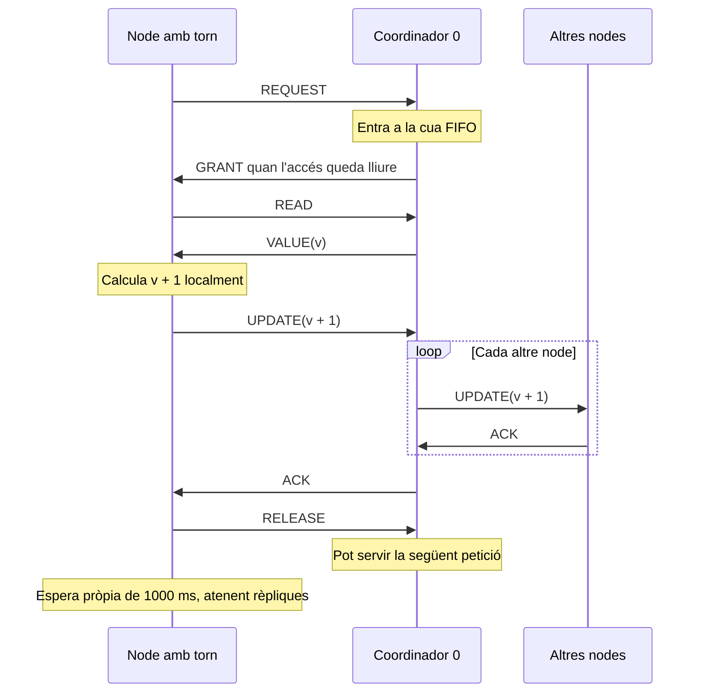

# Pràctica 1: variable compartida amb sockets

Implementació en C, sense frameworks ni memòria compartida. Cada procés conserva
una còpia de l'enter, inicialment 0. El node 0 coordina els torns i també executa
les seves 10 iteracions com a lector o escriptor.

## Sockets en Linux

La implementació utilitza l'API de sockets POSIX de Linux, seguint el material
`Tema5.4.Sockets.pdf` (pàgines 14–24 i 29). Els sockets són descriptors `int`.
El servidor segueix `socket → bind → listen → accept`, i els clients fan
`socket → connect`. Les adreces IPv4 es converteixen amb `inet_pton` i els ports
amb `htons`. La comunicació TCP utilitza `read` i `write`, repetint les operacions
fins a completar la trama; una lectura de 0 bytes indica desconnexió.
Els descriptors es tanquen amb `close`.

## Compilar i executar

Linux / servidor de classe:

```sh
make
# Alternativament:
gcc -std=c99 -Wall -Wextra -Werror -pedantic main.c config.c xarxa.c -o distribuida
```

Obre tres terminals i executa, un procés a cadascun:

```sh
./distribuida 0 127.0.0.1 5000 READ_ONLY 1 127.0.0.1 5001 2 127.0.0.1 5002
./distribuida 1 127.0.0.1 5001 READ_WRITE 0 127.0.0.1 5000 2 127.0.0.1 5002
./distribuida 2 127.0.0.1 5002 READ_WRITE 0 127.0.0.1 5000 1 127.0.0.1 5001
```

És preferible arrencar el 0 primer. Els clients reintenten la connexió inicial
100 vegades amb pauses de 100 ms; el temps real pot ser superior si `connect`
es bloqueja per una xarxa inaccessible. La barrera READY/START espera tots els
nodes declarats al coordinador. No hi ha cap pausa manual ni entrada de teclat.

En aquest exemple tots tres han d'imprimir `Iteracions: 10/10` i `Valor final compartit: 20`.
En general, el valor final és **10 × nombre de nodes READ_WRITE**, inclòs el 0.
Un únic procés també és vàlid: `./distribuida 0 127.0.0.1 5000 READ_WRITE`.
Els IDs poden ser no consecutius; el coordinador sempre és el 0. Les llistes de
servidors, connexions i peticions es reserven dinàmicament segons els arguments:
no hi ha un màxim propi de 32 participants. Es manté el límit de `select` del
sistema (`FD_SETSIZE`, que també limita el número del descriptor).
Tots han d'utilitzar una configuració coherent; el 0 ha de llistar tots els participants.

## Algorisme i relació amb els apunts

La Lecture 1 descriu concurrència, consistència, escalabilitat i les fal·làcies
de la xarxa. Aquí són rellevants perquè llegir i escriure per separat no evita
que dos escriptors perdin increments. Les Lecture 2 part 1 i part 2 descriuen
happens-before i rellotges lògics. Cada procés té un rellotge de Lamport:

- Esdeveniment local o enviament: `L = L + 1`.
- Recepció d'una trama amb rellotge T: `L = max(L, T) + 1`.

El rellotge serveix per observar causalitat; **no proporciona exclusió mútua**.
El bloqueig és el torn exclusiu concedit pel coordinador. És una elecció de
disseny per a aquesta pràctica, no un algorisme de bloqueig extret dels apunts.
No cal sincronitzar rellotges físics amb NTP per garantir la correcció.
Els rellotges vectorials permetrien detectar concurrència, però no són
necessaris per a aquesta solució i afegirien O(N) dades a cada trama.

1. Cada participant envia READY amb el seu ID, sense indicar el seu rol.
2. El coordinador envia START quan tothom està connectat.
3. Cada node envia REQUEST quan està preparat. El coordinador l'afegeix a una
   cua FIFO i envia GRANT només quan no hi ha cap altre node dins la secció crítica.
   L'ordre depèn de la recepció de les peticions, no dels IDs ni de rondes fixes.
   Si diversos sockets estan preparats alhora, es llegeixen en l'ordre de la
   configuració; FIFO no significa ordre temporal global entre ordinadors.
4. El node amb permís envia READ, rep VALUE i utilitza la còpia actualitzada.
5. Si és escriptor, calcula localment `valor + 1` i envia UPDATE amb el valor
   absolut. El coordinador actualitza la seva còpia i envia UPDATE a la resta.
   Espera tots els ACK abans de confirmar l'escriptura al node actiu.
6. El node actiu envia RELEASE. Només aleshores pot començar el següent torn.
7. Cada node espera individualment 1000 ms després d'alliberar l'accés abans
   de demanar-lo de nou. No hi ha una pausa comuna. Un temporitzador i `select`
   permeten atendre rèpliques durant l'espera, sense fils ni altres mecanismes
   IPC. El node 0 també té un temporitzador propi i entra a la mateixa cua;
   la seva petició és un esdeveniment local, sense enviar-se un socket a si mateix.
   Interpretem `sleep(1000)` de l'enunciat com 1000 ms, no 1000 segons de POSIX.
8. Cada node envia DONE després de les 10 iteracions i la darrera pausa.
   Continua servint rèpliques fins que tots han acabat. Llavors STOP/ACK permet
   tancar ordenadament. STOP no modifica el valor compartit.

Una petició REQUEST o DONE pot arribar mentre el coordinador espera l'ACK
d'una rèplica. El coordinador la processa i continua esperant la confirmació,
per evitar errors de protocol o bloquejos quan es creuen missatges.



### Per què no es perden increments?

Només un node executa una iteració en cada moment. El torn cobreix tota la
lectura i escriptura, inclosa la propagació. Abans del següent torn totes les
còpies tenen el valor confirmat. Durant la propagació pot haver-hi còpies
antigues, però cap altre node les utilitza per executar la seva iteració.
Per inducció, partint de zero, cada iteració d'un escriptor afegeix exactament
una unitat. Aquesta garantia assumeix processos correctes i una execució sense
fallades; no és un protocol de consens tolerant a fallades.

Els nodes READ_ONLY no originen escriptures de l'aplicació, però sí que apliquen
UPDATE rebuts per mantenir la seva rèplica correcta.

## Protocol

Connexions TCP persistents en estrella; només el 0 escolta connexions entrants.
La IP/port dels participants es conserva a la configuració original, però
no obren listeners: reben operacions pel socket TCP bidireccional del 0.
Cada trama ocupa exactament 12 bytes: tres enters sense signe de 32 bits en
ordre de xarxa (`htonl`/`ntohl`): tipus, argument i Lamport. Els valors admesos
són de 0 a INT_MAX, suficients per a zero i els increments de l'exercici.

| Codi | Trama | Argument | Funció |
|---|---|---|---|
| 1 | READY | ID | Identificació i barrera inicial |
| 2 | START | 0 | Inici després de la barrera |
| 3 | GRANT | Iteració del node | Concessió exclusiva |
| 4 | READ | 0 | Demanar el valor |
| 5 | VALUE | Valor | Resposta a READ |
| 6 | UPDATE | Valor absolut | Actualització / replicació |
| 7 | ACK | 0 | Confirmació |
| 8 | RELEASE | 0 | Alliberar el torn |
| 9 | STOP | 0 | Finalitzar |
| 10 | REQUEST | Iteració del node | Demanar accés |
| 11 | DONE | 0 | Anunciar que han acabat les 10 iteracions |

Només UPDATE canvia la variable compartida. VALUE retorna una lectura;
READY/START/REQUEST/GRANT/ACK/RELEASE/DONE/STOP només coordinen. No s'envia el mode del node
ni existeix cap trama INCREMENT. Les lectures/escriptures pròpies del node 0
són locals i segueixen el mateix torn exclusiu; la seva escriptura es replica
per sockets. `write` i `read` es repeteixen fins a completar una trama, perquè
TCP no preserva fronteres de missatge.

## Sortida del terminal

Per defecte es mostra el node, el mode, l'estat de connexió i una línia per
iteració. Els escriptors mostren el valor llegit i el valor escrit només després
que l'actualització s'hagi confirmat:

```text
Iteracio  1/10 | Llegit:   0 | Escrit:   1 (confirmat)
Iteracio  2/10 | Llegit:   2 | Escrit:   3 (confirmat)
```

Els lectors mostren `Nomes lectura`. Els valors intermedis depenen de l'ordre
d'accés; el valor final apareix quan tots els nodes han acabat.

Les traces tècniques estan desactivades per defecte. Per activar-les només al
terminal on vulguis investigar els missatges:

```sh
export DISTRIBUIDA_TRACES=1
# Executa el node amb la mateixa comanda habitual.
```

Per tornar a la sortida clara:

```sh
unset DISTRIBUIDA_TRACES
```

Les proves d'integració activen les traces automàticament per comprovar Lamport i FIFO;
també hi ha una prova del grup mixt sense traces per validar la sortida normal.

## Proves i visualització

```sh
python3 tests/integracio.py ./distribuida
python3 tests/peticions.py ./distribuida
```

Les proves comproven arguments invàlids, desconnexió, trames fragmentades,
un node sol, tres lectors, un grup mixt, sis escriptors i 34 lectors
per comprovar la reserva dinàmica més enllà de l'antic límit. Verifiquen totes les
lectures esperades, les 10 iteracions, el resultat final de cada rèplica i
`Lamport(enviament) < Lamport(recepció)` per cada missatge.
També reconstrueixen l'historial d'actualitzacions per validar cada lectura,
comproven exclusió mútua i FIFO i mesuren la pausa individual entre RELEASE i
REQUEST de cada procés. No pressuposen un ordre concret dels nodes.

`tests/peticions.py` utilitza dos participants simulats per comprovar que el
node 2 obté permís abans que l'1 si el demana primer; que un node pot completar
més iteracions sense esperar que un altre demani accés; que REQUEST pot creuar
un UPDATE de replicació; que no hi ha dues concessions simultànies; i que els
nodes continuen rebent rèpliques després de DONE. Aquests participants simulats
ometen expressament les pauses per forçar aquests casos; les pauses dels
processos reals es comproven a `integracio.py`.

Els logs queden a `output/<cas>/node-<id>.log` i les traces reunides a
`output/<cas>/traces.csv`. Cada registre conté node, mil·lisegons des de l'inici local de la xarxa,
Lamport, esdeveniment, peer, tipus i valor. El peer -1 només s'utilitza al
coordinador abans de conèixer l'ID del READY entrant. Els temps són relatius a cada procés
i no s'han de comparar entre nodes; Lamport tampoc mesura durades.

```sh
python3 tests/visualitzar.py output/mixt/traces.csv
```

Genera un SVG amb les lectures per node i el nombre de trames per tipus.
El segon gràfic ajuda a veure el cost de replicar cada escriptura. El generador
utilitza només la biblioteca estàndard de Python, sense dependències addicionals.

## Limitacions i preguntes de la memòria

- **Punt únic de fallada:** si cau el 0, s'atura el sistema. Una desconnexió TCP
  detectada provoca error; no es recupera una escriptura interrompuda ni es
  promet atomicitat davant fallades. No hi ha persistència, elecció de líder,
  autenticació, reintents d'operacions ni gestió de particions.
- **Esperes bloquejants:** un node que es queda penjat sense tancar el socket
  pot bloquejar tothom. També s'espera indefinidament un participant que no
  arriba a la barrera inicial. Caldrien timeouts i una política de recuperació.
- **Concurrència limitada:** també se serialitzen les lectures. La cua FIFO
  evita avançar peticions que ja estan encuades, però un titular del permís
  lent o un node que no confirma una rèplica retarda els altres. Les esperes
  entre iteracions són independents: no obliguen els altres nodes a esperar.
- **Escalabilitat:** amb N nodes, una lectura remota costa 5 trames
  (REQUEST, GRANT, READ, VALUE, RELEASE). Una escriptura remota costa `2N + 3`
  trames: les cinc anteriors, UPDATE/ACK i `2(N-2)` de replicació. Una escriptura
  del coordinador costa `2(N-1)`. Si tots són escriptors, un conjunt d'una
  iteració de cada node costa `(N-1)(2N+5)` trames, és a dir O(N²), sense comptar
  inici i finalització. Ja no hi ha rondes globals. El coordinador i les
  confirmacions seqüencials continuen sent el coll d'ampolla.
- **Afegir nodes en execució:** ara la composició és fixa i es tanca el listener
  després de READY. Caldria mantenir-lo obert, definir JOIN, aturar concessions
  de torn, transferir el valor vigent i confirmar-lo abans d'incloure el nou
  node en la gestió de peticions i en les rèpliques. Cal definir també quantes iteracions
  faria i com afecta la barrera de finalització.

Aquest README és una base per a la memòria, amb les decisions i limitacions
explícites. L'entrega requereix codi i informe en dos fitxers separats; encara
cal preparar l'informe final amb les captures i mesures que vulgueu presentar.

## Estil del codi C

- Noms de variables i funcions en català, excepte `main` i les funcions de les
  biblioteques. Els noms de les trames i els arguments READ_ONLY/READ_WRITE
  continuen igual que al protocol documentat.
- Declaracions al principi de cada funció, agrupades per tipus i inicialitzades.
  La compilació també activa `-Wdeclaration-after-statement`.
- Les claus d'obertura van a la mateixa línia que els `if`, `else`, `for`,
  `while` i les funcions. Cada condició queda sencera en una sola línia, encara
  que sigui llarga. El cos i la clau de tancament van en línies separades.
- Condicions amb `int` i `if/else`, sense `goto`, ternaris, `bool`, `size_t`, `ssize_t`,
  `uint32_t`, `const` ni `static` al codi propi.
- Memòria dels participants i de la cua reservada segons la configuració, amb
  comprovació de reserva i `free` a la sortida, també quan hi ha errors.
- Els tres enters de cada trama són un format fix del protocol, no un buffer
  amb una mida arbitrària. S'utilitza `unsigned int` per a `htonl`/`ntohl`.
- Es conserven els tipus de sockets i rellotges que demana el sistema operatiu.
  `long` només s'utilitza per recollir el resultat de `strtol` abans de validar
  que cap dins d'un `int`. Els temps de l'aplicació es representen amb `int`
  en mil·lisegons; estan pensats per a execucions curtes de la pràctica.
- Les funcions auxiliars es comparteixen entre operacions o separen passos
  identificables del protocol. Les funcions `coordinador` i `participant`
  gestionen els recursos i els tanquen quan retorna l'execució, tant si ha
  acabat correctament com si ha fallat. No es fan servir salts a etiquetes.
